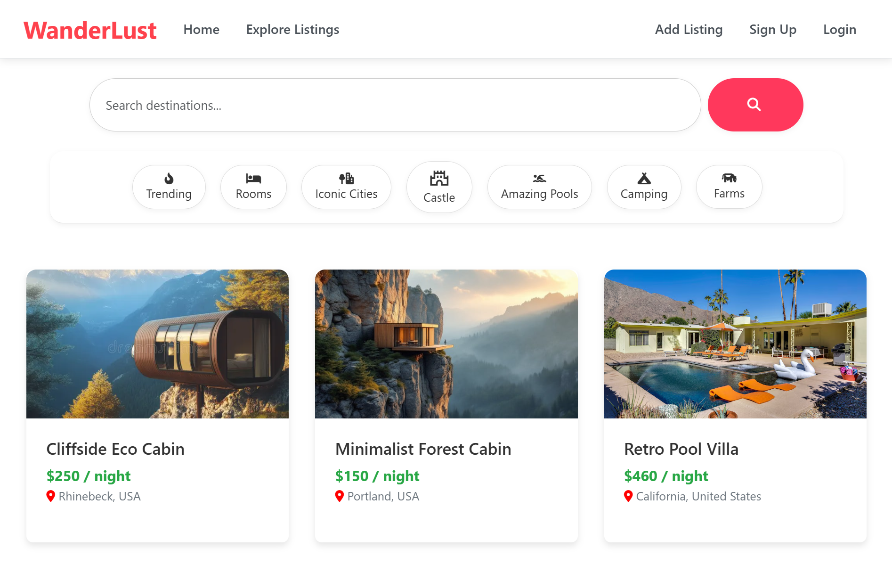
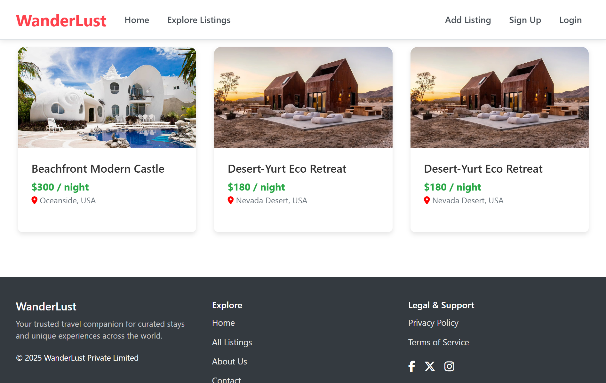
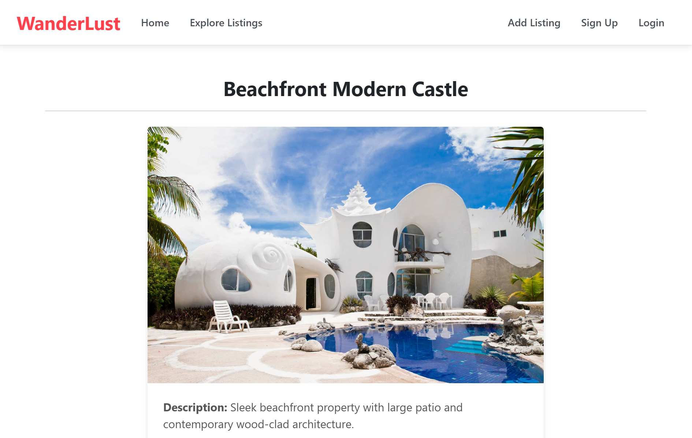

# 🌍 WanderLust

**WanderLust** is a full-stack web application that allows users to discover, list, and review travel stays and unique experiences across the globe. Inspired by platforms like Airbnb, this app is built using Node.js, Express, MongoDB, and EJS.

---

## 🚀 Features

- 🏡 **List and manage stays** with images, pricing, and locations
- 🔍 **Filter listings** by categories (Rooms, Farms, Castles, etc.)
- 🧭 **Browse featured listings** on the homepage
- 📝 **User authentication** with secure sessions
- 📸 **Image uploads** via Cloudinary
- ✏️ **Leave reviews and ratings** for listings
- 📱 **Fully responsive** modern UI
- 🌐 **Informational static pages** (About, Contact, Privacy, Terms)

---

## 🛠️ Tech Stack

**Backend:**  
- Node.js  
- Express.js  

**Frontend:**  
- EJS templating  
- Bootstrap 5 + Custom CSS  
- Font Awesome  

**Database & Cloud:**  
- MongoDB with Mongoose  
- Cloudinary (for image hosting)  
- Multer (file uploads)  

**Auth & Session:**  
- Passport.js (Local Strategy)  
- express-session  
- connect-mongo  
- dotenv (environment variables)

---

## 📦 Installation

### Prerequisites

- Node.js (v18+ recommended)
- MongoDB (local or MongoDB Atlas)
- Cloudinary account

### Clone & Setup

```bash
# Clone the repository
git clone https://github.com/AshishSinsinwal/wanderlust-listing-app.git
cd wanderlust-listing-app

# Install dependencies
npm install
```

### Environment Configuration

Create a `.env` file in the root directory and add:

```env
CLOUDINARY_CLOUD_NAME=your_cloud_name
CLOUDINARY_KEY=your_api_key
CLOUDINARY_SECRET=your_api_secret
DB_URL=mongodb://localhost:27017/wanderlust
SECRET=your_session_secret_key
```

### Run the Application

```bash
# Start the server
node app.js
```

Then open [http://localhost:8080](http://localhost:8080) in your browser.

---

## 📁 Project Structure

```
wanderlust/
├── public/              # Static files (CSS, client-side JS, images)
├── controllers/         # Route handlers and business logic
│   ├── listings.js
│   ├── reviews.js
│   └── users.js
├── routes/              # Express route definitions
│   ├── listings.js
│   ├── reviews.js
│   └── users.js
├── models/              # Mongoose schemas and models
│   ├── listing.js
│   ├── review.js
│   └── user.js
├── views/               # EJS templates and layouts
│   ├── layouts/
│   ├── listings/
│   ├── reviews/
│   └── users/
├── utils/               # Utility functions and helpers
│   └── ExpressError.js
├── middleware/          # Custom middleware functions
├── init/                # Database initialization scripts
├── app.js               # Main application entry point
├── package.json         # Project dependencies and scripts
└── .env                 # Environment variables (not tracked in git)
```

---

## 🌟 Usage

1. **Sign Up/Login** to create an account
2. **Browse Listings** on the homepage or use filters
3. **Create New Listings** with photos, descriptions, and pricing
4. **Leave Reviews** and rate your experiences
5. **Manage Your Listings** through your user dashboard
6. **Locate Your Listings** through maps


---

## 📸 Screenshots

<!-- Add your screenshots here -->




---

## 🔧 Development

### Available Scripts

```bash
# Start development server
npm start

# Start with nodemon (auto-restart)
npm run dev
```

### Contributing

1. Fork the repository
2. Create a feature branch (`git checkout -b feature/amazing-feature`)
3. Commit your changes (`git commit -m 'Add some amazing feature'`)
4. Push to the branch (`git push origin feature/amazing-feature`)
5. Open a Pull Request

---

## 🚀 Deployment

This app can be deployed on platforms like:
- **Heroku**
- **Railway**
- **Render**
- **DigitalOcean**

Make sure to set your environment variables in your deployment platform.

---

## 🙌 Acknowledgements

- Inspired by **Airbnb's** UI/UX design
- **Font Awesome** & **Bootstrap** for beautiful styling
- **Cloudinary** for seamless image management
- **MongoDB** for reliable data storage

---

## 📄 License

This project is open source under the [MIT License](LICENSE).

---

## 👨‍💻 Author

**Made with ❤️ by [Ashish Sinsinwal](https://github.com/AshishSinsinwal)**

---

## 📞 Contact

- **GitHub**: [@AshishSinsinwal](https://github.com/AshishSinsinwal)
- **Email**: your.email@example.com
- **LinkedIn**: [Your LinkedIn Profile](https://www.linkedin.com/in/ashish-sinsinwal-a31b48318)

---

*Happy Wandering! 🌍✈️*
